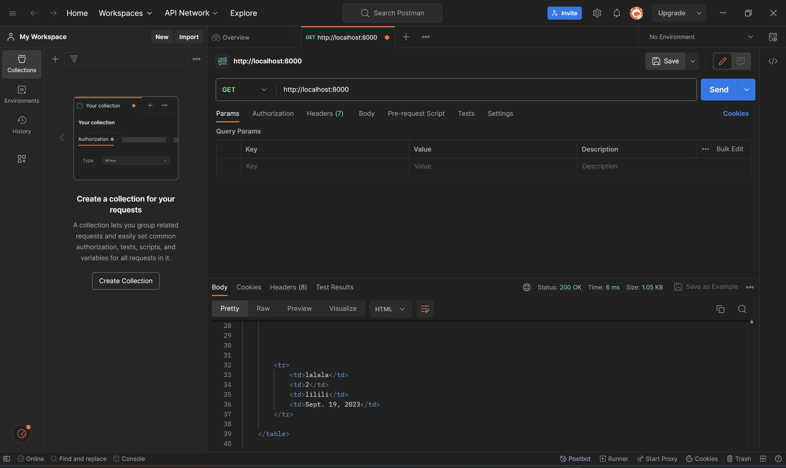
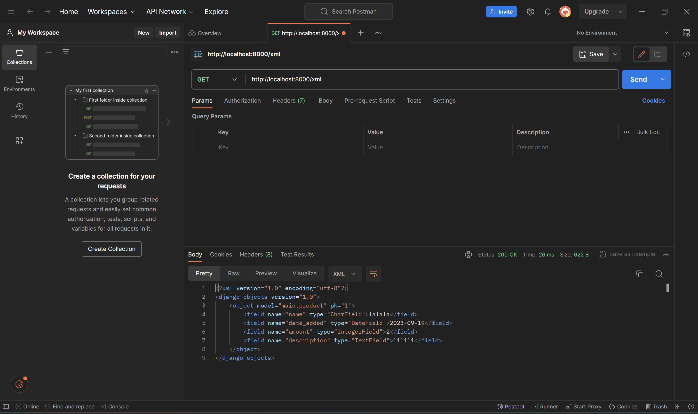
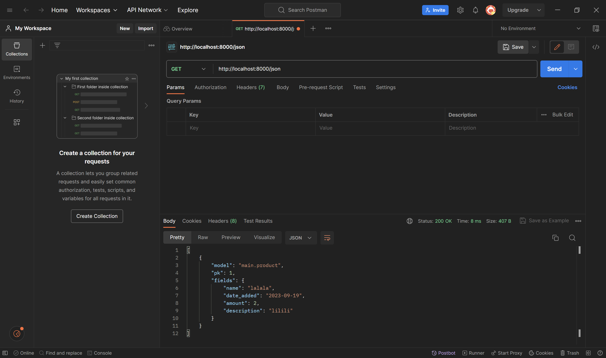
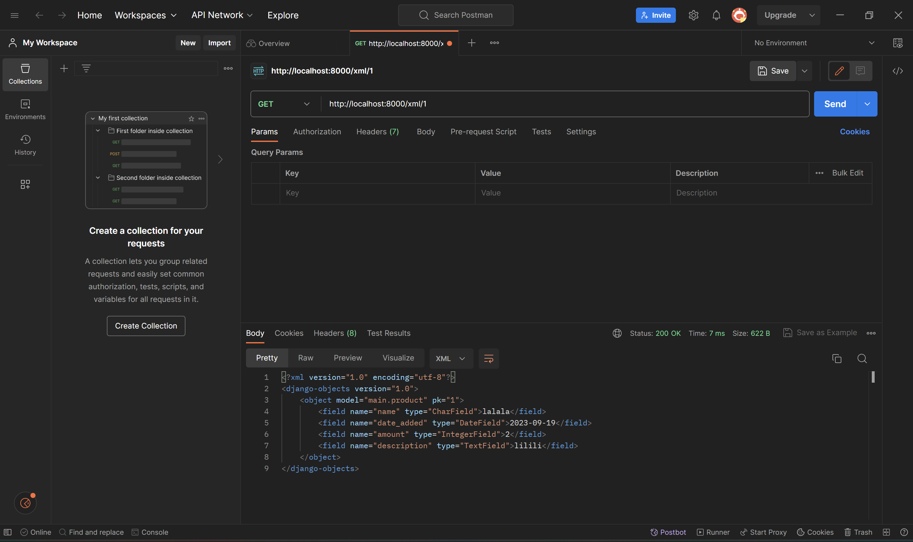
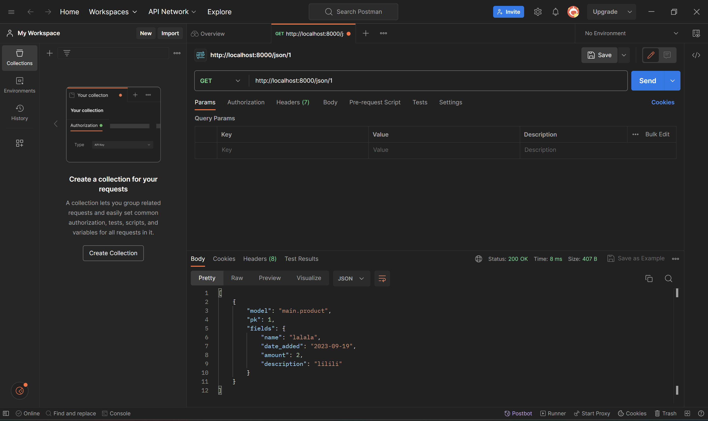

# razzle-fresh-stock
Click untuk menuju website [razzle-fresh-stock](https://razzle-fresh-stock.adaptable.app)

# Apa itu Django UserCreationForm?
Django `UserCreationForm` adalah sistem authentication built in dari Django. Ketika kita menggunakan `UserCreationForm`, maka akan terbuat secara otomatis form field untuk mengisi username, password, dan password confirmation. Selain itu, kita bisa menambahkan field-field lain sesuai dengan yang kita tambahkan ke model `User`. Django `UserCreationForm` ini digunakan untuk membuat user baru yang dapat menggunakan web app.<br>
Kelebihan dari menggunakan `UserCreationForm` antara lain:
1. praktis
2. dapat dikustomisasi
3. konsisten
Kekurangan dari menggunakan `UserCreationForm` antara lain:
1. hanya dapat digunakan dengan model built-in Django `User`.
2. sangat minimalis

# Perbedaan antara Authentication dan Authorization di Django
Secara general, authentication atau autentikasi adalah proses memverifikasi identitas user, dan authorization atau otorisasi adalah proses menentukan akses apa saja yang diperbolehkan kepada suatu user.<br>
Dalam konteks Django, autentikasi diimplementasikan dalam suatu views dan forms built-in dari Django yang bernama `UserCreationForm`. `UserCreationForm` digunakan untuk melakukan autentikasi user. Sedangkan untuk otorisasi, contohnya adalah decorator `@login_required` yang digunakan untuk memberikan restriksi kepada user agar melakukan login terlebih dahulu sebelum dapat mengakses web app.

# Apa itu _Cookies_?
_Cookies_ adalah data berukuran kecil yang dikirim oleh web server kepada browser User dan disimpan di device User. _Cookies_ digunakan untuk menyimpan data sementara di sisi klien. Data ini digunakan untuk meningkatkan user experience serta membuat berbagai fungsi dapat berjalan di web app.<br>
Django menggunakan _cookies_ untuk mengelola sesi user web app. Karena HTTP merupakan stateless protocol, maka Django menggunakan session ID yang disimpan sebagai _cookies_ untuk melakukan holding state. Kemudian, session ID ini dapat dipetakan ke data di web server sehingga User dapat menyimpan semua inormasi yang dibutuhkan.

# Apakah Penggunaan _Cookies_ Aman secara Default dalam Pengembangan Web?
Dalam pengembangan suatu web app, penggunaan _cookies_ sangat esensial. Penggunaan _cookies_ dibutuhkan dalam pengembangan berbagai fungsi serta testing task. <br>
Penggunaan _cookies_ relatif aman jika digunakan dengan benar. Namun, ada juga berbagai risiko dan potensi masalah yang harus diwaspadai seperti :
1. kebocoran informasi pribadi
2. serangan XSS (_Cross Site Scripting_)
3. serangan CSRF (_Cross Site Request Forgery_)

# Implementasi Checklist Tugas 4
step-by-step
## Mengimplementasikan fungsi registrasi, login, dan logout
1. mengimport fungsi-fungsi di `views.py` yang akan digunakan yaitu :
```
from django.shortcuts import redirect
from django.contrib.auth.forms import UserCreationForm
from django.contrib import messages  
from django.contrib.auth import authenticate, login, logout
```
2. buat fungsi register, login_user dan logout_user dengan code seperti berikut ini :
```
def register(request):
    form = UserCreationForm()

    if request.method == "POST":
        form = UserCreationForm(request.POST)
        if form.is_valid():
            form.save()
            messages.success(request, 'Your account has been successfully created!')
            return redirect('main:login')
    context = {'form':form}
    return render(request, 'register.html', context)

def login_user(request):
    if request.method == 'POST':
        username = request.POST.get('username')
        password = request.POST.get('password')
        user = authenticate(request, username=username, password=password)
        if user is not None:
            login(request, user)
            return redirect('main:show_main')
        else:
            messages.info(request, 'Sorry, incorrect username or password. Please try again.')
    context = {}
    return render(request, 'login.html', context)

def logout_user(request):
    logout(request)
    return redirect('main:login')
```
3. membuat berkas baru bernama `register.html` di folder main/templates. berikut isi dari file:
``` 



    <title>Register</title>


  

<div class = "login">
    
    <h1>Register</h1>  

        <form method="POST" >  
              
            <table>  
                {{ form.as_table }}  
                <tr>  
                    <td></td>
                    <td><input type="submit" name="submit" value="Daftar"/></td>  
                </tr>  
            </table>  
        </form>

      
        <ul>   
              
                <li>{{ message }}</li>  
                  
        </ul>   
    

</div>  


```
4. membuat file baru bernama `login.html` di direktori main/templates. berikut isi dari `login.html`
```



    <title>Login</title>




<div class = "login">

    <h1>Login</h1>

    <form method="POST" action="">
        
        <table>
            <tr>
                <td>Username: </td>
                <td><input type="text" name="username" placeholder="Username" class="form-control"></td>
            </tr>
                    
            <tr>
                <td>Password: </td>
                <td><input type="password" name="password" placeholder="Password" class="form-control"></td>
            </tr>

            <tr>
                <td></td>
                <td><input class="btn login_btn" type="submit" value="Login"></td>
            </tr>
        </table>
    </form>

    
        <ul>
            
                <li>{{ message }}</li>
            
        </ul>
         
        
    Don't have an account yet? <a href="">Register Now</a>

</div>


```
5. menambahkan potongan code di `main.html`
```
<a href="">
    <button>
        Logout
    </button>
</a>
```
6. mengimpor fungsi `register`, `login_user`, dan `logout_user` serta menambahkan pathnya di `urls.py` di direktori main.

## Membuat dua akun pengguna dengan masing-masing 3 dummy data
berikut dua akun pengguna dengan 3 dummy data 
<br>


## Menghubungkan model item dengan User
1. buka file `models.py` lalu tambahkan kode dibawah ini untuk mengimport model.
```
from django.contrib.auth.models import User
```
2. tambahkan code dibawah ini pada model Product
```
user = models.ForeignKey(User, on_delete=models.CASCADE)
```
3. pada file `views.py`, tambahkan potongan code di bawah ini ke dalam fungsi create product
```
def create_product(request):
 form = ProductForm(request.POST or None)

 if form.is_valid() and request.method == "POST":
     product = form.save(commit=False)
     product.user = request.user
     product.save()
     return HttpResponseRedirect(reverse('main:show_main'))
```
4. ubah code pada fungsi `show_main` menjadi seperti berikut
```
def show_main(request):
    products = Product.objects.filter(user=request.user)

    context = {
        'name': request.user.username,
    ...
```
5. save perubahan lalu lakukan makemigrations. dalam proses migration akan ada error, lalu pilih 1 untuk menetapkan default value untuk field user pada semua row yang telah dibuat pada basis data. lalu pilih 1 lagi untuk menetapkan user ID 1 pada model yang sudah ada. setelah itu lakukan migrate.

## Menampilkan detail informasi user yang sedag logged in seperti username dan emnerapkan cookies seperti last_login


# Apa Perbedaan POST dan GET dalam Django?
Dalam Django, POST dan GET adalah dua method HTTP yang digunakan dalam penggunaan form. Kedua method ini memiliki fungsi yang berbeda. <br>

1. **POST** : form login Django dikembalikan ke server menggunakan method POST. Dengan menjalani method POST maka akan mengubah keadaan server.
2. **GET** : Method GET digunakan untuk mengambil data dari server. Method GET mengumpulkan data yang disubmit/dikirim lalu menjadikannya sebuah URL. URL tersebut berisi address dimana data harus dikirimkan beserta keys dan valuesnya. 

# Apa Perbedaan antara XML, JSON, dan HTML dalam Pengiriman Data?
Terdapat perbedaan utama antara XML dan JSON dengan HTML. XML dan JSON digunakan sebagai penyimpanan dan transmisi data sedangkan HTML digunakan untuk menjelaskan bagaimana data tersebut ditampilkan. <br>
XML (_Extensible Markup Language_) berasal dari SGML (_Standard Generalized Markup Language_). Pada XML kita dapat membuat custom tag dan struktur dokumen. Syntax XML lebih boros daripada JSON.
JSON (_JavaScript Object Notation_) dibuat berdasarkan bahasa JavaScript. Pada JSON sudah terdapat data type yang telah ditentukan sebelumnya. Syntax JSON lebih simple/sederhana dibandingkan XML. JSON lebih banyak digunakan dalam aplikasi data delivery di web modern.

# Mengapa JSON Sering Digunakan dalam Pertukaran Data dalam Web Modern?
JSON memiliki ukuran file yang lebih kecil dengan transmisi data yang lebih cepat dibandingkan dengan XML. Syntax tag yang terdapat pada XML membuat lebih kompleks untuk ditulis sehingga membuat ukuran file yang lebih besar.

# Implementasi Checklist Tugas 3
step-by-step
## Membuat input form untuk menambahkan objek model pada app sebelumnya
1. membuat berkas `forms.py` dalam direktori `main`. Lalu mengisi berkas `forms.py` dengan kode berikut:
```
from django.forms import ModelForm
from main.models import Product

class ProductForm(ModelForm):
    class Meta:
        model = Product
        fields = ["name", "amount", "description"]
```
2. menambahkan import pada berkas `views.py` yang ada di direktori `main`.
```
from django.http import HttpResponseRedirect
from main.forms import ProductForm
from django.urls import reverse
```
3. membuat fungsi `create_product` di dalam berkas `views.py`. Berikut isi dari fungsi `create_product`:
```
def create_product(request):
    form = ProductForm(request.POST or None)

    if form.is_valid() and request.method == "POST":
        form.save()
        return HttpResponseRedirect(reverse('main:show_main'))

    context = {'form': form}
    return render(request, "create_product.html", context)
```

## Tambahkan 5 fungsi views untuk melihat objek yang sudah ditambahkan dalam format HTML, XML, JSON, XML by ID, dan JSON by ID
**HTML**
1. menambahkan kode `products = Product.objects.all()` di dalam fungsi `show_main` berkas `views.py`. serta menambahkan kode `'products': products` di dalam context.
2. import fungsi `create_product` serta menambahkan path url `path('create-product', create_product, name='create_product'),` ke dalam `urlpatterns` di berkas `urls.py` di folder `main`.
3. membuat berkas HTML baru pada direktori `main/templates` bernama `create_product.html`. berikut isi dari `create_produdct.html` :
```
 


<h1>Add New Product</h1>

<form method="POST">
    
    <table>
        {{ form.as_table }}
        <tr>
            <td></td>
            <td>
                <input type="submit" value="Add Product"/>
            </td>
        </tr>
    </table>
</form>


```
4. menambahkan potongan kode ke dalam `` untuk menampilkan data produk.
```
...
<table>
    <tr>
        <th>Name</th>
        <th>Price</th>
        <th>Description</th>
        <th>Date Added</th>
    </tr>

     Berikut cara memperlihatkan data produk di bawah baris ini 

    
        <tr>
            <td>{{product.name}}</td>
            <td>{{product.price}}</td>
            <td>{{product.description}}</td>
            <td>{{product.date_added}}</td>
        </tr>
    
</table>

<br />

<a href="">
    <button>
        Add New Product
    </button>
</a>


```
5. setelah semua step diatas dilakukan, jalankan proyek Django dengan menjalankan perintah `python manage.py runserver` di terminal serta membuka http://localhost:8000 (memindahkan path main/ ke home). Tambahkan beberapa input form dari web, maka data dapat dilihat dalam bentuk HTML.

**XML, JSON, XML by ID, JSON by ID**
1. menambahkan import ke dalam `views.py` di dalam direktori `main`.
```
from django.http import HttpResponse
from django.core import serializers
```
2. untuk XML dan JSON, membuat fungsi dengan parameter `request` dengan sebuah variabel yang menyimpan hasil query seluruh data yang ada pada `Product`. serta tambahkan return berupa `HttpResponse` <br>
XML :
```
def show_xml(request):
    data = Product.objects.all()
    return HttpResponse(serializers.serialize("xml", data), content_type="application/xml")
```
JSON :
```
def show_json(request):
    data = Product.objects.all()
    return HttpResponse(serializers.serialize("json", data), content_type="application/json")
```
3. untuk XML by ID dan JSON by ID, variabel menyimpan data dengan id tertentu. <br>
XML by ID:
```
def show_xml_by_id(request, id):
    data = Product.objects.filter(pk=id)
    return HttpResponse(serializers.serialize("xml", data), content_type="application/xml")
```
JSON by ID:
```
def show_json_by_id(request, id):
    data = Product.objects.filter(pk=id)
    return HttpResponse(serializers.serialize("json", data), content_type="application/json")
```

## Membuat _routing_ URL untuk masing-masing views yang telah ditambahkan
menambahkan import fungsi yang sudah dibuat ke `urls.py` pada folder `main`.
```
from main.views import show_main, create_product, show_xml, show_json, show_xml_by_id, show_json_by_id 
```
kemudian tambahkan path url ke dalam `urlpatterns` untuk mengakses fungsi yang sudah diimport.
```
...
path('xml/', show_xml, name='show_xml'), 
path('json/', show_json, name='show_json'), 
path('xml/<int:id>/', show_xml_by_id, name='show_xml_by_id'),
path('json/<int:id>/', show_json_by_id, name='show_json_by_id'),
...
```

# Akses URL menggunakan Postman
HTML :


XML :


JSON :


XML by ID :


JSON by ID :


# Implementasi Checklist Tugas 2
step-by-step pengerjaan proyek Django.

## Membuat Proyek Django Baru
1. Mempersiapkan direktori lokal baru yaitu razzle_fresh_stock serta repositori di GitHub bernama razzle-fresh-stock.
2. Melakukan inisiasi repositori lokal dengan repositori GitHub dengan melakukan perintah `git init` pada command prompt direktori lokal.
3. Membuat branch baru dengan menjalankan perintah `git branch -M master` di command prompt direktori lokal.
4. Menghubungkan repositori lokal dengan repositori GitHub dengan menjalankan perintah `git remote add origin master`.
5. Membuat _virtual environment_ dengan menjalankan perintah `python -m venv env` di command prompt direktori lokal.
6. Menjalankan _virtual environment_ dengan menjalankan perintah `env\Scripts\activate.bat` di command prompt direktori lokal. _Virtual environment_ digunakan untuk mengisolasi package sehingga tidak bertabrakan dengan app lainnya.
7. Membuat berkas requirements.txt yang berisi _dependencies_. Isi dari file _dependencies_ mengikuti tutorial.
8. Menginstall _dependencies_ dengan menjalankan perintah `pip install -r requirements.txt` di dalam _virtual environment_.
9. Membuat proyek razzle_fresh_stock dengan menjalankan perintah `django-admin startproject razzle_fresh_stock .`.
10. Menambahkan '*' pada `ALLOWED HOSTS` di `settings.py` untuk mengizinkan akses dari semua host.
11. Menjalankan server Django dengan menjalankan perintah `python manage.py runserver`, kemudian membuka link http://localhost:8000 untuk mengecek apakah 
12. Mematikan server dengan `Ctrl+C` serta mematikan _virtual environment_ dengan menjalankan perintah `deactivate`.
13. Menambahkan berkas `.gitignore` agar beberapa berkas tidak ditrack. Isi dari berkas .gitignore mengikuti tutorial 0.
14. Melakukan git add, commit, push.

## Membuat Aplikasi dengan Nama main pada Proyek
1. Aktifkan _virtual environment_.
2. Buat aplikasi/app baru bernama `main` dengan menjalankan perintah `python manage.py startapp main`.
3. Mendaftarkan aplikasi `main` dengan cara memasukkan `'main'` ke dalam variabel `INSTALLED_APPS` di dalam file settings.py

## Melakukan Routing pada Proyek
1. Buka berkas `urls.py` yang adaa di dalam direktori `razzle_fresh_stock`, lalu impor fungsi include dari library `django.urls`.
2. Menambahkan rute URL ke dalam variabel `urlpatterns`
```
urlpatterns = [
    ...
    path('main/', include('main.urls')),
    ...
]
```

## Membuat Model pada Aplikasi main
1. Membuka file `models.py` pada direktori `main`.
2. Isi file `models.py` dengan kode:
```
from django.db import models

class Product(models.Model):
    name = models.CharField(max_length=255)
    date_added = models.DateField(auto_now_add=True)
    amount = models.IntegerField()
    description = models.TextField()
```
5. Setiap variabel pada file `models.py` akan dihubungkan ke views.
6. Jalankan perintah `python manage.py makemigrations`. Perintah ini dijalankan untuk membuat berkas migrasi perubahan dari isi file `models.py` yang belum diaplikasikan ke database.
7. Jalankan perintah `python manage.py migrate`. Perintah ini dijalankan untuk mengaplikasikan perubahan models yang ada di dalam berkas migrasi.

## Membuat Fungsi pada views.py
1. Pastikan sudah memiliki file template HTML.
2. Tambahkan baris impor `from django.shortcuts import render`.
3. Tambahkan fungsi `show_main`. Isi fungsi `show_main` dengan data-data yang ingin digunakan.

## Membuat Routing pada urls.py dalam Direktori main
1. Membuat file `urls.py` di dalam direktori `main`.
2. Mengisi `urls.py` dengan kode berikut :
```
from django.urls import path
from main.views import show_main

app_name = 'main'

urlpatterns = [
    path('', show_main, name='show_main'),
]
```

## Melakukan Deployment ke Adaptable
1. Pilih tombol New App di dashboard Adaptable
2. Pilih Connect an Existing Repository, lalu pilih repositori `razzle-fresh-stock`
3. Pilih Python App Template sebagai template deployment
4. Pilih PostgreSQL sebagai tipe database yang digunakan
5. Cocokkan versi python dengan python yang ada di dalam virtual environment 
6. Masukkan perintah `python manage.py migrate && gunicorn shopping_list.wsgi` ke Start Command
7. Masukkan nama domain yang diinginkan yaitu razzle-fresh-stock
8. Centang bagian `HTTP Listener on PORT` lalu klik deploy app

# Bagan Request Client


1. User memberikan request ke Django melalui browser. Django bekerja sebagai controller melakukan pengecekan keberadaan resource di `urls.py`.
2. Jika ditemukan URL, `views.py` akan dipanggil. `views.py` akan berinteraksi dengan model dan template.
3. `models.py` adalah interface dari database. 
4. `main.html` adalah template dari bagian yang statis/tidak berubah dari web app.
5. `views.py` adalah user interface. `views.py` berinteraksi dengan `models.py` untuk mendapatkan data. `views.py` juga berinteraksi dengan `main.html` untuk mendapatkan output HTML yang diinginkan.

# Mengapa harus menggunakan _virtual environment_?
Penggunaan _virtual environment_ dilakukan dengan mengisolasi package serta dependencies dari aplikasi yang sedang kita buat. Mengisolasi package dilakukan untuk menghindari adanya tabrakan antara versi-versi lain aplikasi yang ada di devicemu. Dengan mengaktifkan _virtual environment_ kita memiliki kontrol penuh untuk membuat versi yang kita inginkan. Membuat aplikasi tanpa _virtual environment_ tetap dapat dilakukan, namun lebih baik digunakan.

# Apa itu MVC, MVT, MVVM?
MVC, MVT, dan MVVM adalah pola desain arsitektur yang yang membagi aplikasi menjadi beberapa komponen.<br />

**MVC** 
1. Model : pusat komponen arsitektur. Mengelola data, logika, serta constraints dari aplikasi.
2. View :  mengatur bagaiaman data akan ditampilkan dan menyediakan berbagai macam data representasi komponen.
3. Controller : memanipulasi  Model
 dan render view dengan menjadi sebagai jembatan antara keduanya.

 **MVT**
 1. Model : bekerja sebagai interface dari database. Dalam garis besar adalah struktur logika dibalik keseluruhan web app.
 2. View : berinteraksi dengan model dan template. Menerima HTTP request dan mengembalikan HTTP responses.
 3. Template : bagian statis dari web app. Berupa kode HTML.

 **MVVM**
 1. Model : menyimpan logika program.
 2. View : kumpulan elemen yang tampak, termasuk user interface. Menerima user input. 
 3. ViewModel : terletak di antara view dan model. Letak kontrol interaksi dengan view.

Perbedaan utama antara MVC, MVT, dan MVVM adalah peran penenah komponen. Pada MVC, yang berperan sebagai penengah komponen adalah Controller. Pada MVT, yang menjadi penengah adalah View. Sedangkan pada MVVM, yang menjadi penengah adalah ViewModel.
